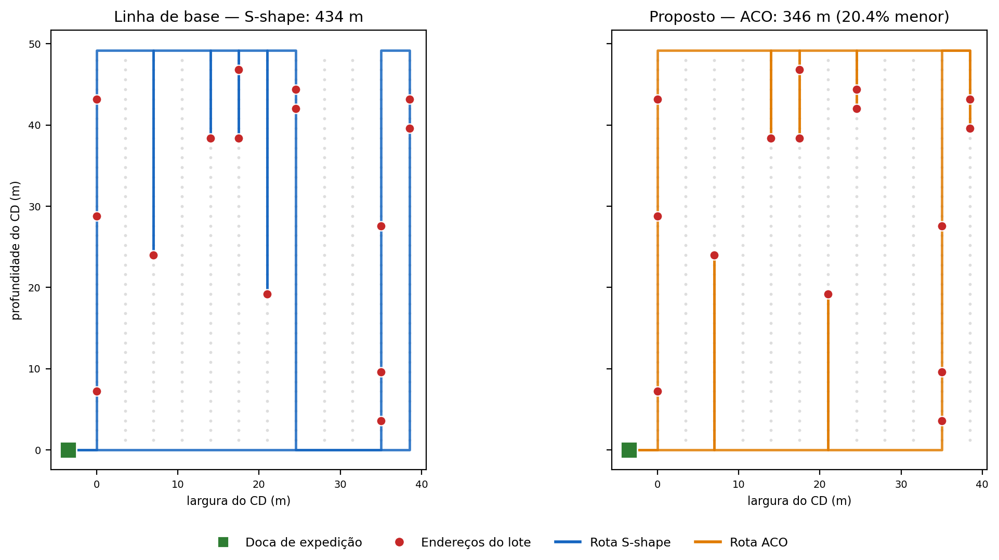
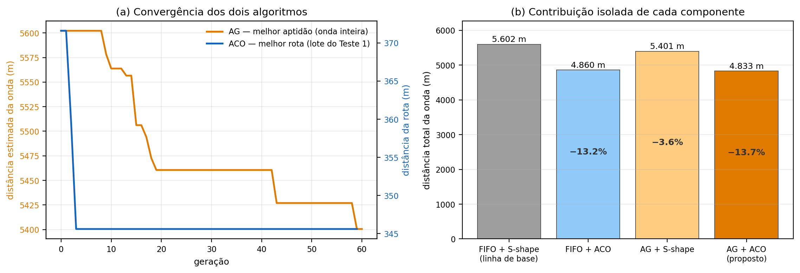
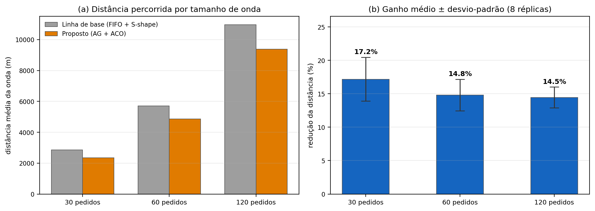

# Otimização de rotas de separação em Centro de Distribuição

Implementação de um pipeline de meta-heurísticas — **Algoritmo Genético** para formação de lotes e
**Otimização por Colônia de Formigas (ACO)** para roteirização — aplicado ao problema de *order
picking* em armazéns, com avaliação experimental controlada.

Tudo escrito do zero em Python, sem biblioteca de otimização pronta.



> Mesmo lote de itens, duas estratégias de percurso. À esquerda, a heurística *S-shape* que os
> sistemas de gestão de armazém costumam embutir; à direita, a rota construída pela colônia de
> formigas.

---

## O problema

Num centro de distribuição, o separador de pedidos passa a maior parte do turno **andando**. A
revisão de De Koster, Le-Duc e Roodbergen (2007) estima que o *picking* consuma até 55% da despesa
operacional de um armazém, sendo o deslocamento a maior fatia — tempo que não agrega valor ao
produto.

Duas decisões acopladas determinam essa distância:

- **OBP** (*Order Batching Problem*) — quais pedidos vão no mesmo lote de separação;
- **PRP** (*Picker Routing Problem*) — em que ordem visitar os endereços de cada lote.

O PRP é uma variante do Problema do Caixeiro Viajante de Steiner e pertence à classe NP-difícil: um
lote com 30 endereços admite 30! sequências possíveis. A restrição prática, porém, não é matemática —
é que a resposta precisa sair em **segundos**, porque pedidos entram e são cancelados ao longo de
todo o turno.

## A abordagem

| Etapa | Técnica | Papel |
|---|---|---|
| 1 | Grafo do armazém (505 nós) + **Floyd–Warshall** | matriz de distâncias reais de caminhamento |
| 2 | **Algoritmo Genético** | atribuição pedido → lote, respeitando a capacidade do carrinho |
| 3 | **Colônia de Formigas** | sequência de visita dentro de cada lote |

A linha de base é o que um WMS convencional faz: agrupamento **FIFO** e roteirização **S-shape**.

O armazém é modelado como grafo não direcionado — o separador só circula pelos corredores e pelas
duas transversais, nunca atravessa as estruturas porta-paletes. É isso que torna a distância real
diferente da euclidiana.

## Resultados

Três experimentos, todos no notebook:

**1. Exemplo didático** — um lote, 15 endereços em 8 corredores:

| | Distância |
|---|---|
| S-shape | 434,4 m |
| ACO | **345,6 m** (−20,4%) |

**2. Experimento fatorial** — uma onda de 60 pedidos nas quatro combinações possíveis, para isolar a
contribuição de cada componente:



| Configuração | Distância total | Redução |
|---|---|---|
| FIFO + S-shape (base) | 5.602,2 m | — |
| FIFO + ACO | 4.860,0 m | −13,2% |
| AG + S-shape | 5.400,6 m | −3,6% |
| **AG + ACO** | **4.833,2 m** | **−13,7%** |

**3. Escalabilidade** — ondas de 30/60/120 pedidos, 8 réplicas independentes cada:



| Tamanho da onda | Redução média | Desvio-padrão |
|---|---|---|
| 30 pedidos | 17,2% | 3,3 p.p. |
| 60 pedidos | 14,8% | 2,4 p.p. |
| 120 pedidos | 14,5% | 1,6 p.p. |

O ganho se sustenta em todas as faixas, e a dispersão **cai** conforme a onda cresce.

## O achado mais interessante

O experimento fatorial contrariou a expectativa inicial: **quase todo o ganho vem da roteirização**.
O ACO sozinho, aplicado sobre os lotes FIFO que já existiam, captura 13,2 dos 13,7 pontos
percentuais disponíveis — 96% do benefício. O algoritmo genético contribui com apenas 3,6 pontos.

A causa é uma decisão de projeto documentada no notebook: para não rodar o ACO milhares de vezes
dentro do laço evolutivo, a função de aptidão do AG usa o estimador barato (*S-shape*). Isso faz o
AG otimizar um critério que **não é** o usado na solução final — ele mira o alvo errado.

Corrigir exigiria uma aptidão mais fiel: um ACO curto e barato dentro da avaliação, ou um estimador
calibrado sobre rotas ACO já computadas. Registrar a limitação define com precisão o próximo passo,
e leva a uma recomendação prática de sequenciamento: **implantar primeiro o roteirizador**, que tem
menor custo de integração e entrega quase todo o retorno.

## Dados

Não há acesso a uma base real de WMS. Os dados são **gerados sinteticamente**, mas reproduzindo as
três propriedades que determinam a dificuldade do problema real:

- **concentração da demanda** em curva ABC — 20% dos endereços respondem por 84,5% das linhas;
- **dispersão espacial** dos itens populares, que ficam espalhados pelo armazém em vez de
  concentrados perto da doca (reproduz endereçamento estático revisto uma vez por ano);
- **perfil de pedido de e-commerce**, com 1 a 6 linhas.

A geração é controlada por semente fixa. A reprodutibilidade foi verificada: em duas execuções
completas e independentes, todos os resultados algorítmicos se repetiram de forma idêntica —
divergiram apenas os tempos de processamento.

> **Nota.** O cenário empresarial é fictício e os dados são simulados. O projeto nasceu de um
> trabalho acadêmico e não representa dados de nenhuma empresa real.

## Como executar

Requisitos: Python 3.10+, `numpy`, `pandas`, `matplotlib`, `jupyter`.

```bash
git clone <url-do-repositorio>
cd <pasta>
jupyter lab otimizacao_picking.ipynb
```

O notebook roda de ponta a ponta em poucos minutos e já vem com todas as saídas gravadas — dá para
ler o resultado inteiro sem executar nada. Os números medidos ficam consolidados em
`resultados.json`.

## Estrutura

```
otimizacao_picking.ipynb   notebook completo, executado
resultados.json            indicadores medidos na última execução
fig1_rotas.png             rotas S-shape vs. ACO num mesmo lote
fig2_convergencia.png      convergência dos algoritmos e experimento fatorial
fig3_escalabilidade.png    ganho por tamanho de onda
```

## Referências

- DE KOSTER, R.; LE-DUC, T.; ROODBERGEN, K. J. Design and control of warehouse order picking: a
  literature review. *European Journal of Operational Research*, v. 182, n. 2, p. 481-501, 2007.
- DE SANTIS, R.; MONTANARI, R.; VIGNALI, G.; BOTTANI, E. An adapted ant colony optimization
  algorithm for the minimization of the travel distance of pickers in manual warehouses. *European
  Journal of Operational Research*, v. 267, n. 1, p. 120-137, 2018.
- DORIGO, M.; STÜTZLE, T. *Ant colony optimization*. Cambridge: MIT Press, 2004.
- HOLLAND, J. H. *Adaptation in natural and artificial systems*. Ann Arbor: University of Michigan
  Press, 1975.
- ALLGOR, R. J.; ÇEZIK, T.; CHEN, D. Algorithm for robotic picking in Amazon fulfillment centers
  enables humans and robots to work together effectively. *INFORMS Journal on Applied Analytics*,
  v. 53, n. 4, p. 266-282, 2023.
